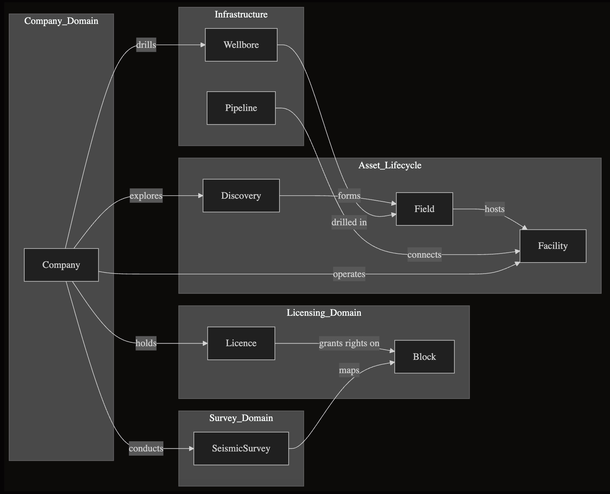

Mundi includes a demo PostGIS database sourced from the Norwegian Offshore Directorate. It includes 111 tables and covers everything from licence awards on offshore blocks to discoveries, producing fields, wells, platforms, pipelines, seismic surveys, and the companies involved. 

This database is meant to be complex enough to give you a sense of what Mundi might be like when you connect your own data. Feel free to explore it and see how easy Mundi makes working with PostGIS.

To connect to this database, read here: [Connecting to a demo PostGIS database](/getting-started/connecting-to-demo-postgis)

:::note[Open Data License]
Data: Norwegian Offshore Directorate • Licence: Norwegian Licence for Open Government Data
:::

## What’s inside

This is a high level overview of what is in the database.

**Licensing**  
- **licence** – Production licence permits: ID, name, status, grant/expiry dates, map polygon.  
- **block** – Offshore blocks that licences sit on: ID, name, area, quadrant, polygon.  
- **licence_licensee_hst** – Time-series of who held each licence and their interest %.

**Exploration & fields**  
- **discovery** – Initial finds: ID, name, year, link to a field, polygon.  
- **discovery_reserves** – Recoverable volumes per discovery.  
- **field** – Producing fields: ID, name, activity status, discovery year, polygon.  
- **field_reserves** – Remaining volumes per field (and by company where applicable).

**Infrastructure**  
- **facility** – Platforms/structures: ID, name, type, phase, water depth, point/polygon.  
- **pipeline_thin** – Transport pipelines: ID, name, diameter/medium, line geometry.

**Wellbores**  
- **wellbore** – Each drilled well: ID, name, status, purpose, key dates, coordinates, geometry.  
- **wellbore_log** – Logged intervals and types for each well.

**Seismic & surveys**  
- **seis_acquisition** – Survey metadata: ID, name, dates, status, 2D/3D area.  
- **seis_acquisition_poly_total** – Footprint polygons (gross/net).  
- **sbm_survey_area** – Other survey polygons (ROV, sampling), with company, year, area.

**Corporate & references**  
- **company** – Legal entities across the lifecycle: IDs, names, org number, nationality.  
- **strat_litho** – Lithostratigraphic units referenced by well data.

### Diagram of tables

## How you can work with it in Mundi

**Ask Questions in Plain Language**  
Examples of the kinds of questions you can type (Mundi will translate to SQL for you):  
- Show wells drilled after 2015.  
- Highlight fields operated by a specific company.    
- Who held a particular licence on a specific date?  
- Find the nearest pipeline to a particular wellbore.
- Which seismic surveys since 2021 cover more than 500 km²?
- When has company A purchased from company B? 
- Which company operates the most facilities in a field? 

**Visualize**  
Add any table as a layer, then style by status, volume, year, or any attribute (choropleths, outlines, labels, etc.).

**Follow Relationships**  
Jump from a licence to its holders over time, from a field to its discoveries and facilities, or from a company to everything it owns or operates.

---

To see how to use Mundi with spatial databases, read this: [Working with PostGIS database](/guides/connecting-to-postgis/#working-with-postgis-database)