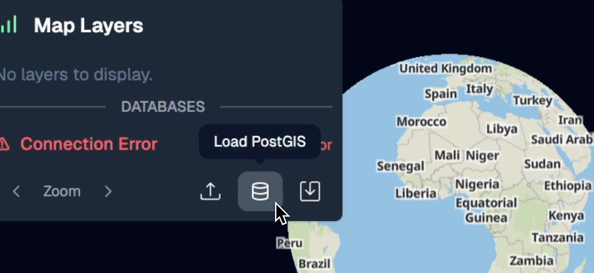
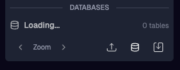
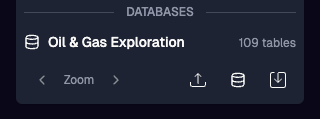
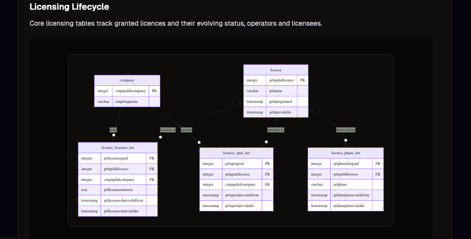
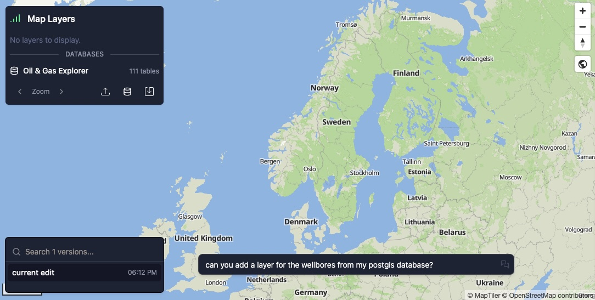
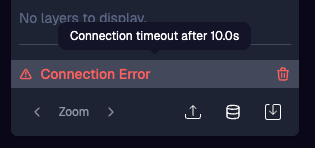
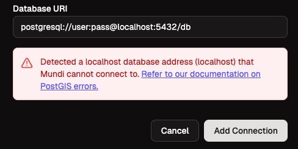

Mundi can connect to pre-existing PostGIS databases and can create visualization layers from PostGIS tables via custom queries,
generate Wiki-like documentation of your database schema, and execute queries to answer questions about the data.

## Connecting for the first time

### 1. Click the 'Load PostGIS' button in the layer list




### 2. Enter connection details

You should prefer [read-only users](#creating-a-read-only-user-for-mundi) for security.


If someone else hosts your database, you should ask them for these details.

### Migrating from QGIS

You can also connect to the same PostGIS database that you normally use from QGIS as long as it's not hosted locally.


This allows you to work with the same spatial data across both Mundi and QGIS environments.

## Working with PostGIS database

Give the database some time to load. During this time, Mundi is generating wiki-like documentation about
your database schema.

:::note[Be patient!]
One US-located database with 100 tables will take 2-5 minutes to load. If your database is located outside
of the US (for Mundi cloud) or has 1,000+ tables this may take 10+ minutes.
:::



Once it's loaded, it will appear in your project's database list, with an AI generated name and table count.



### AI database documentation

You can hover over the database name and click on it to view the generated wiki page.


The wiki page is generated by an AI model that sees your database schema, example data, foreign key
relationships, etc. It includes diagrams explaining the how different tables relate to eachother:



### Creating layers from PostGIS queries

Once connected, you can ask Kue, the AI assistant in Mundi, to create new map layers that source
spatial data from the connected PostGIS database.

:::tip[Request to Kue]
can you add a layer for the wellbores from my postgis database?
:::





## Best practices and errors

### Creating a read-only user for Mundi

We recommend that users create read-only database users for Mundi to use. This read-only user should only
have access to the tables that you intend to use Mundi to analyze.


Here is how you might go about creating this user:

```sql
CREATE USER mundi_readonly WITH PASSWORD '...';
GRANT SELECT ON spatial_table_1, polygon_table_2 TO mundi_readonly;
```

Opened connections to third-party PostGIS databases from Mundi are always opened as read-only, so there are only
additional risks to allowing the user write access.

:::caution
For databases requiring high data privacy, we always recommend either on-premise deployment of Mundi
cloud or self-hosting Mundi open source.
:::


### Options when self-hosting Mundi open source

You can set the environment variable `POSTGIS_LOCALHOST_POLICY` to one of the following values:
- `disallow` prevents users from connecting to loopback addresses, which can help prevent unauthorized
  access and connections to databases running on the host machine
- `rewrite` which is useful for connecting to PostgreSQL running on the host machine. This tells Docker to
  redirect localhost to the host machine, instead of the Docker container
- `allow` to allow connections to localhost databases. Because Docker localhost is different from your
  computer's localhost, this rarely makes sense

### Debugging common problems

If your PostGIS database fails to connect, hover over the connection error to see the full error message.



If you've looked into the below issues and can't connect, you can ask in our [community Discord](https://discord.gg/V63VbgH8dT).

#### Localhost databases on Mundi cloud

If you normally connect to your database from QGIS or similar using `localhost` or `127.0.0.1`, the database
is running on your local computer and will not be accessible from Mundi cloud (or any other cloud service).




You would need to create a replica of your PostgreSQL database on a cloud provider and provide us that
connection string instead to connect Mundi to your data.

#### Connection timeout

If the connection times out (Mundi defaults to 10 second limit), it's likely that the database
is not accessible from the internet, either due to a firewall or the database is on your local
network. In order to be accessible, the database must be pinned to a public static IPv4 address
allowing ingress and egress traffic.
