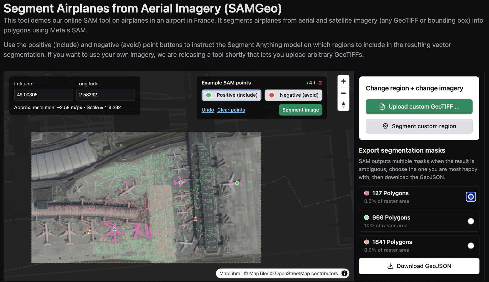
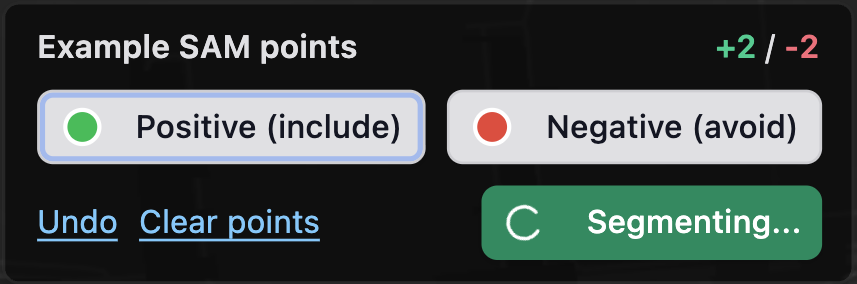
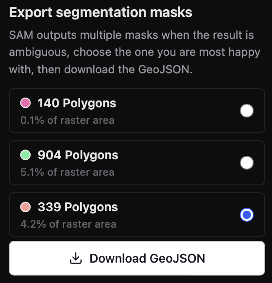
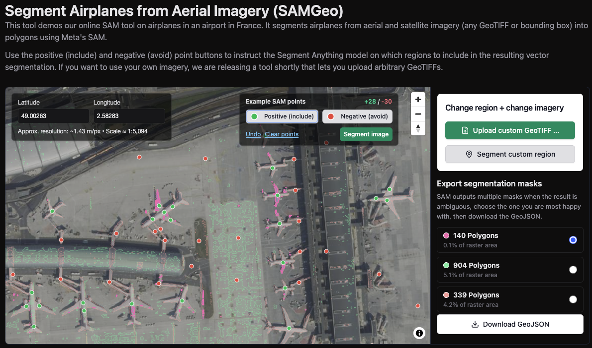
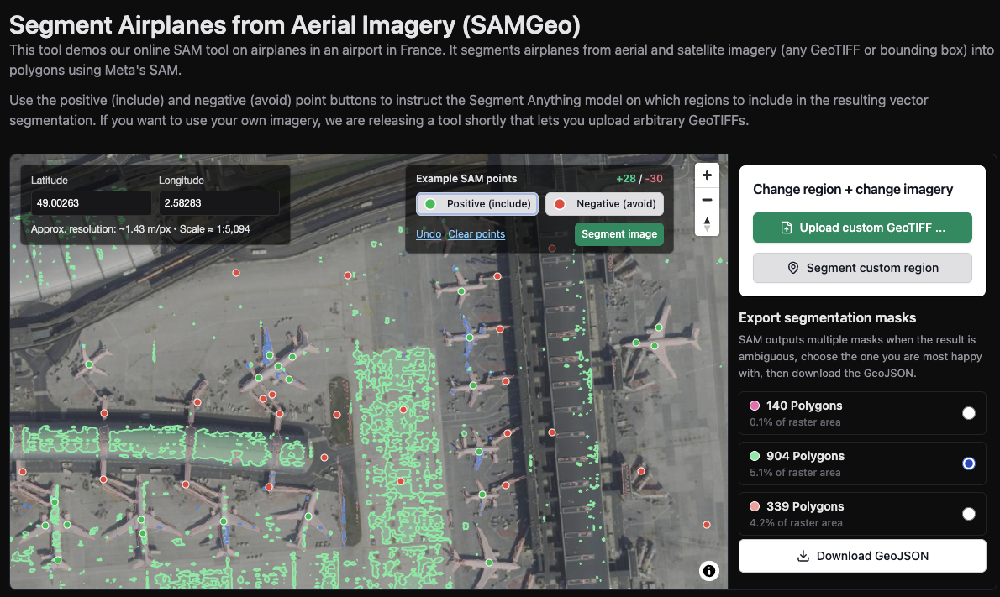
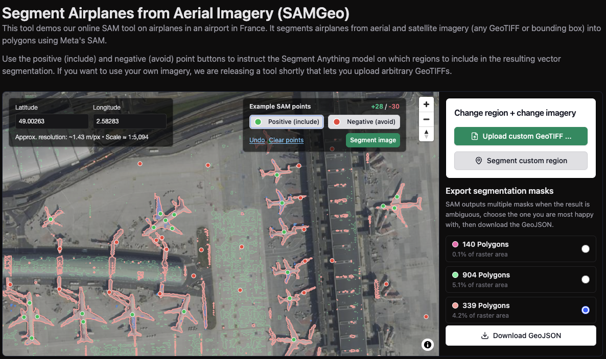

You can access run Segment Anything [online in Mundi](https://app.mundi.ai/tools/segment-anything/airplanes) to extract polygons from aerial
imagery, satellite imagery, and traditional maps. These polygons are already processed
in Mundi to be downloadable as vector spatial data as a GeoJSON.

The Segment Anything tool available in Mundi uses [Meta's SAM 2](https://ai.meta.com/sam2/). To
use the model, you add points to what you want to segment, and points to anything
which resembles your target to teach the model what not to segment. You will be shown
three different possible outcomes from the model and select the best one for download.

You can access the Segment Anything tool online, and do not need to own a GPU or download
any model. You can upload any imagery you need to segment or use our catalogue of imagery. 
Using the Segment Anything tool on your custom imagery requires a [Mundi subscription](https://mundi.ai/pricing), starting at $45/month. 
There are sample locations with imagery loaded you can evaluate on in Mundi.

 

## Introduction to Segment Anything

Segment Anything is a foundation model from Meta AI that predicts object masks given simple 
prompts such as points or boxes. We adapt Segment Anything for geospatial workflows by 
supporting GeoTIFFs and satellite imagery as inputs so that the polygons are already 
georeferenced and supporting GeoJSON exports that you can add to any GIS platform such as Mundi. 

## Adding data to segment

You can upload your own GeoTIFF to the Segment Anything tool or work with our own 
catalogue of aerial imagery. Selecting your own region or adding your own imagery
requires a [Mundi Basic subscription](https://mundi.ai/pricing). If you first want to evaluate the Segment 
Anything model, you can try our free public examples. 

:::note
If your imagery is not yet georeferenced, try our [AI Georeferencer](https://docs.mundi.ai/guides/ai-georeferencer-for-aerial-imagery/). 
:::

### Free public examples

You can evaluate the Segment Anything tool without a paid account using our sample
imagery of popular targets. We update this list as we create more examples. If you
want to evaluate our tool on anything specific, email sales@buntinglabs.com

1. [Detect Aircraft in Aerial Imagery](https://app.mundi.ai/tools/segment-anything/airplanes)

## How to run the Segment Anything tool  

Unlike other Segment Anything applications, there are no downloads needed to run 
Mundi's Segment Anything tool. You only need to find the imagery you want to segment, 
add your positive and negative points, and download your preferred result. 

This will walk through the best practices for the four steps to get the best output: 
1. Select what you want to segment 
2. Refine the output with negative examples
3. Pick the best segmentation from three versions
4. Download the result 

### Select what you want to segment 

To pick what you want to segment, you add points to your target to teach the model 
what it is. The more points you can add the better, and if you have multiple targets
in one image (for example, buildings in a neighborhood) it is best to add points to
multiple targets. 

The positive point button is selected by default, and you can find it in the top
right portion of the view box with a green circle and the words **Positive (include)**.

:::note
You can also undo your last selection with the Undo link, or start over with the Clear points link in the same menu. 
:::

### Add negative examples to refine the model 

Once you have positive examples, you should add negative examples of what you do not
want to segment. This helps the model understand what is your target and what is not. 
If something looks generally similar to your target, but you do not want it included,
you should add a point or two to it, and do that in as many places as possible. 

The negative example button is to the right of the positive example button with a red
circle and the words **Negative (avoid)**.

:::note
The Undo and Clear points also apply to the negative example points.
:::

### Select the best output

Once you have added the negative and positive points, the segmentation model will 
automatically run. You can alternatively hit the green **Segment image** button to
run the model again. 

The model will provide three different outputs so you can select the best one. The
best output may not be at the top, so it's best to check all three. If you are not
happy with the output, you can add more points and run the model again. 

Here, you can see the difference between three different model outputs. Notice how
the most accurate is the third option. 

## Export the data

Once you are happy with the output, select the **Download GeoJSON** button below
the different output choices to download the polygons. You can add this new vector
file to Mundi or your other GIS of choice. 